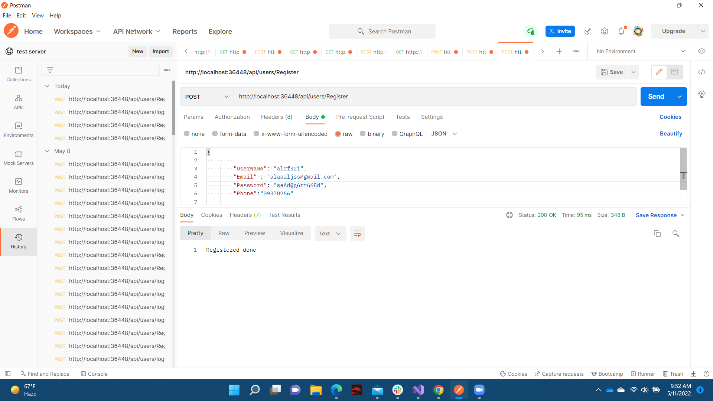
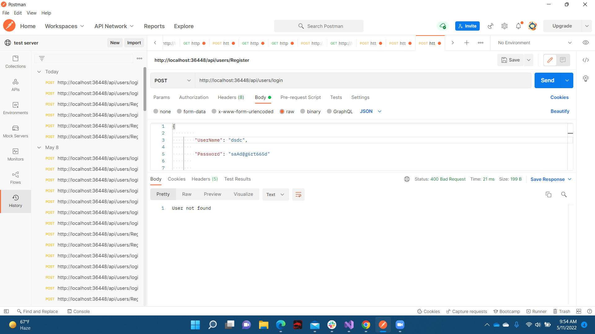
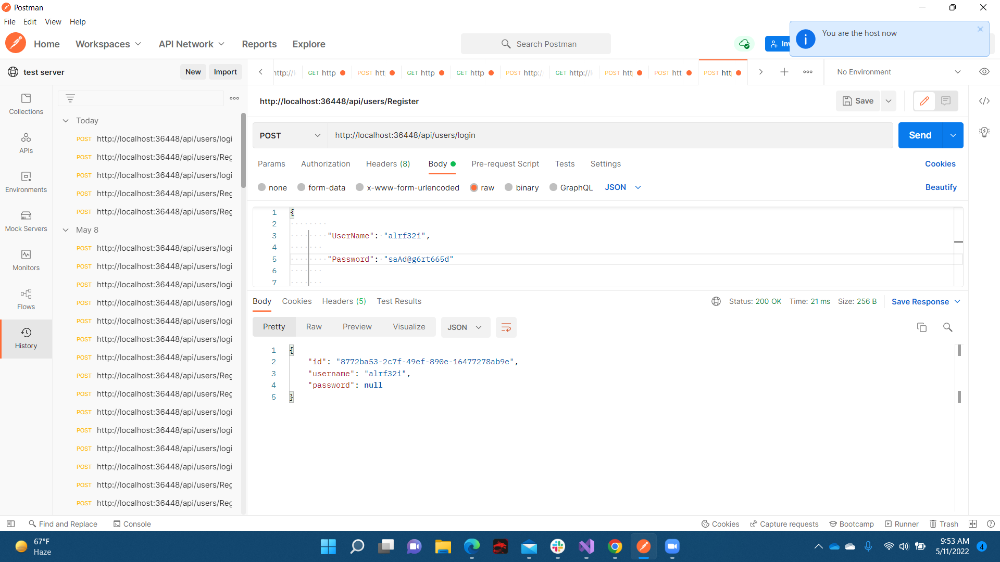
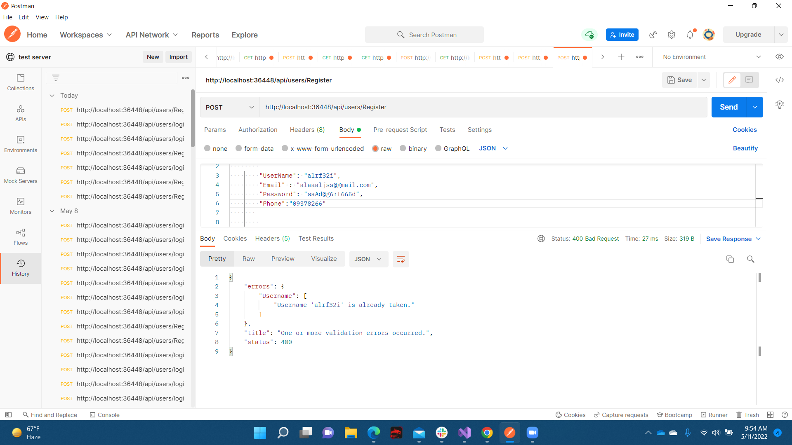
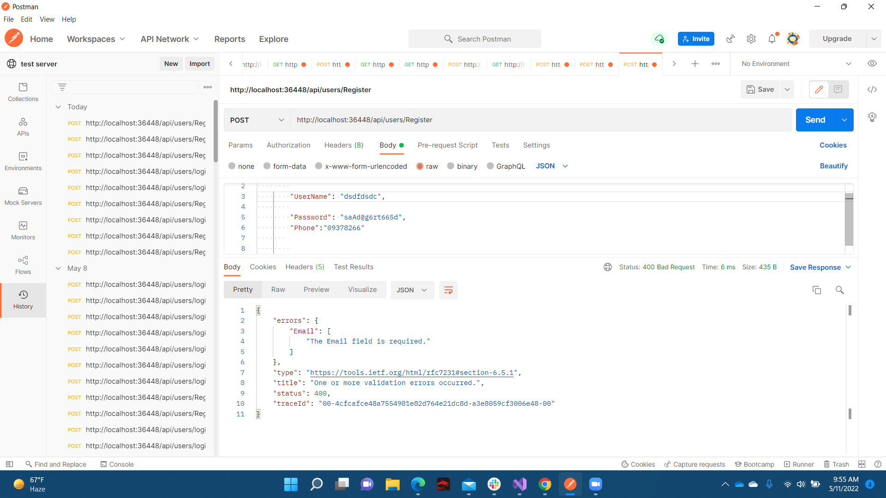
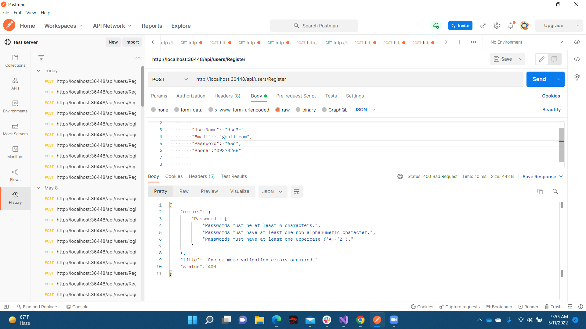

## Async Hotel
AsyncInn is a web application implamenting a database in order to manage hotel rooms in a hotel chain. With this application, the user should be able to create Hotels, Rooms, and Amenities, and connect those objects together appropriately.

***
**Developer:** Aladdin Alhanini

**Date:** 13/4/2022

ERDiagram

### Entities:
**Hotels:** Hotels have a 1:many relationship with hotel rooms, which means that each hotel can have multiple rooms.

**Rooms:** Rooms indicates a specific room type that can vary based on layout. A room type can belong to many hotels.

**Amenities:** There are a variety of amenities such as air-conditioning, a coffee maker, etc. A room can have many different amenities which is represented in the 1:many relationship.

**RoomAmenities:** This is a pure join table that has a combination of AmenitiesID and RoomID as a composite key. The many:1 relationship assures that an amenity will only be applied to a room once.

**HotelRoom:** This table has a composite key of HotelID and RoomNumber. This allows multiple hotel locations to use the same room number.

### Architectural Patterns

*Architectural Patterns define the physical or logical structure of the solution at the highest level. Architectural patterns require all the parts of the system that are touched by the pattern to participate in its design.*
It can be classified into various categories:

- ##### Client/Server
Distributes the system into two applications, where the client makes requests to the server. In many cases, the server is a database or any other application that serves as Server.

- ##### Component-Based
Decomposes application design or logic into reusable functional or logical components that expose well-defined properties or methods to interact with the components such as Grid, Button, Data Adapter etc.

- ##### Domain Driven Design
Domain Driven Design is an OOPS approach to designing  software applications by modeling a business domain and defining Business Objects based on Entities.

- ##### Layered Architecture
Partitions the concerns of the application into stacked groups (layers) and are deployed on the same computer.

- ##### Message Bus
An architecture style that prescribes the use of a software system that can receive and send messages using one or more communication channels, so that applications can interact without needing to know specific details about each other.

- ##### N-Tier / 3-Tier
Distributes the functionality into separate parts in much the same way as the layered style, but with each part being a tier located on a physically separate computer.

- ##### Object-Oriented
Object Oriented design is the process of creating self-sufficient objects having a set of properties and methods which deals with the specific logic or functionality of an application and can also contain the set of data as part of functionality. 

- ##### Service-Oriented Architecture (SOA)
SOA is nothing but an Application that provides services to other applications independent of any platform or technology that exposes and consumes functionality as a service using contracts and messages.

### Identity
ASP.NET Core Identity provides a framework for managing and storing user accounts in ASP.NET Core apps. Identity is added to your project when Individual User Accounts is selected as the authentication mechanism. By default, Identity makes use of an Entity Framework (EF) Core data model

#### Register

#### login user not found

#### login sucsisfuly

#### user name is already taken

#### missing email

#### password not strong

